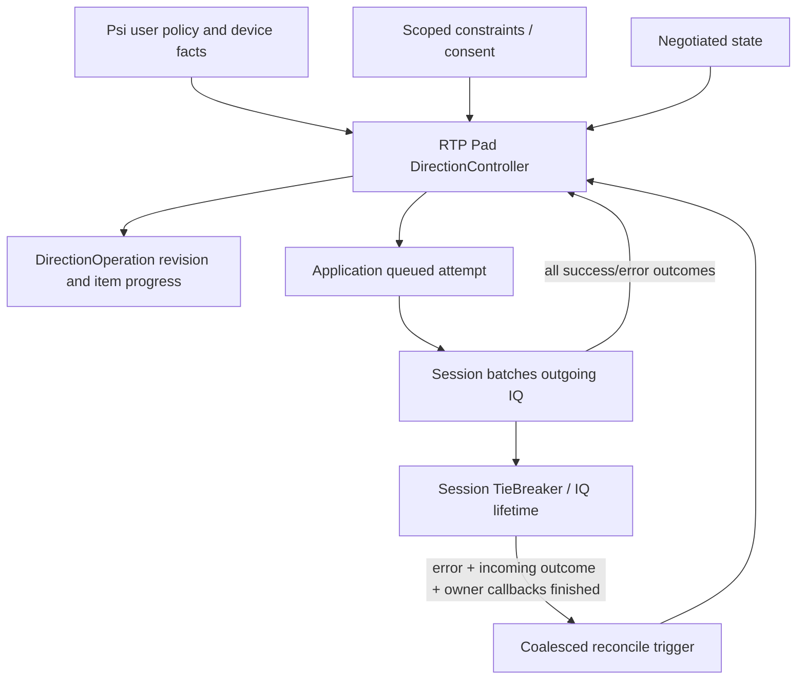

# Direction policy, operations and tie-break: design decision

Architecture assessment at Iris `fb7678d088834830e58b8bd733018a8ef83f72d2`, 2026-09-17.
Implementation checkpoint: T0 hardening, T1 attempt notifications, the T2 Pad controller
and T3 finite operation handles are implemented (local Jingle suite: 50/50). Psi's audio
direction policy now uses this API through AvCallAudioDirection. These changes are local
worktree changes, not CI evidence.
Current signaling architecture is documented in [jingle.md](jingle.md).

## Decision

Keep the session-owned Jingle-specific TieBreaker. Do not replace it with another generic
template state machine. Separate three lifetimes: durable desired policy, observable logical
operation, and concrete signaling attempt. Tie-break resolution is a fourth, short-lived
correlation record; it does not own any of the other three.

One RTP Pad-scoped direction controller can coordinate RTP contents. Psi supplies user/device
facts; Iris does not discover microphones, ask permission, or decide UI policy. Initially use
one authoritative policy writer per content plus explicit constraint tokens. Do not introduce
an arbitrary IntentSource priority system without a real caller requiring it.

## TieBreaker contract

- Continue means ordinary parsing, not acceptance.
- Break rejects the entire IQ, even if only one content conflicts. No sibling may be committed
  merely because its resolver returned Continue.
- Postpone means ordinary incoming handling plus a recovery opportunity after a failed local
  transaction. It does not delay the incoming IQ or mandate resending anything.
- Success produces no **tie-break recovery**. The higher controller still reevaluates current
  policy after every state/attempt outcome; an accepted old proposal need not satisfy a newer
  request or a subsequently applied peer change.
- Recovery waits for local terminal outcome, owner callbacks, and incoming-processing outcome.
  It must not run transport-affecting work ahead of the incoming IQ reply. Prefer a guarded,
  coalesced queued reconcile after reply dispatch; do not rely on every resolver merely emitting
  updated(). Nested event loops remain prohibited.
- RemoteResult::Applied means ordinary handler accepted the action, not whole-operation
  success. It does not express per-content transport partial outcomes.
- RetryContext XML/error references are callback-scoped. Deferred consumers copy what they
  need, and must not retain reference members. Coordinator XML must be immutable snapshots;
  copying a QDomElement handle alone does not isolate it from node mutation.

Break > Postpone > Continue is appropriate for the wire decision. Evaluate all live resolvers
from a stable registration snapshot, but only while the coordinator generation remains valid.
Continuing after Break is not permission to continue after clear()/destruction.

Advisory hints may be collected even for a rejected action, but only after bounded structural
validation. They must not install transports, alter negotiated state or start networking during
resolve(). Prefer decision/pure hint collection followed by an explicit outcome phase.
Otherwise one resolver can mutate state before another rejects the IQ.

Use a resolution record associated with a transaction ID and remote outcome, containing
independently cancellable registration IDs. This is a bookkeeping group, NOT a user-operation
group. Multiple resolutions may wake the same controller; coalesce by generation/revision.
Generic IQ failure must notify all participating attempts, including non-overlapping contents
whose resolver returned Continue. TieBreaker is not their completion channel.

## Implemented low-level contracts

TieBreaker pins SharedState across callbacks and uses a cancellation epoch. clear/destruction
stops the current dispatch snapshot. Resolver/transaction IDs are rechecked after callbacks;
transaction iterators do not survive user code. Caller XML is deep-copied. Duplicate completion
cannot replace the first outcome. Registrations are still RAII and must precede resolver storage
destruction. Session serialization is asserted, not replaced by a multi-IQ scheduler.

At most 64 pending arbitration resolutions are retained. Incoming snapshots are limited to
4096 nodes/attributes, depth 64 and 256 Ki UTF-16 characters (including attribute names/values).
These are arbitration-history limits, not general stanza parser limits. Overload returns a
separate `Resolution::error` (`wait/resource-constraint`), never a fabricated tie-break.
JTPush sends the ordinary IQ result/error before calling incomingFinished/recovery. Guards cover
resolver dispatch, outgoing owner callbacks and post-recovery scheduling.

Application::requestSendersTracked returns a scheduling revision, retaining requestSenders as
a bool compatibility wrapper. `sendersAttemptFinished(SendersAttemptResult)` reports attempt ID,
revision, exact target, Accepted/Rejected/TimedOut/Cancelled and stanza error where applicable.
This is a synchronous per-attempt event after state cleanup, not a logical operation API.
No-op/proposal-only requests have no IQ attempt; QObject::destroyed is the lifetime termination
notification if deletion precedes completion. Finishing cancels a live attempt; saved duplicate
callbacks cannot mutate a newer attempt or a deleted Application.
`cancelQueuedSenders(revision)` discards only that disposable queued revision; it cannot unsend
an in-flight IQ. `sendersAttemptPending()` exposes the concrete in-flight boundary.

RTP::Pad::directionController() exposes the first single-writer controller. setLocalSending()
owns only the local sending bit; suspendLocalSending() returns an independently revocable RAII
constraint. Policy snapshots expose revision, desiredSending, constrained,
Pending/Satisfied/Blocked/Failed/Finished, typed failure, optional signaling error and constraint
reason labels. policyChanged is a coalesced queued live-state notice,
not one-shot completion. The controller is opt-in per Application: unmanaged contents keep the
existing behavior. Managed contents must not mix controller policy with direct requestSenders.

The packet gate closes synchronously, separately from queued signaling. It does not stop actual
device capture: Psi must still apply the same user/device facts to psimedia capture controls.
Constraints combine by restriction and identify content incarnations, not reusable names.
Tie-break recovery recomputes the local bit against live peer sending; generic errors fail
without an automatic retry loop. Both rejected and repeatedly countermanded successful proposals
are bounded by three scheduled proposals per policy/constraint generation. A new explicit policy
or constraint event resets that budget. Finite observation deadlines belong to DirectionOperation,
not this durable controller. Failures distinguish signaling rejection, IQ timeout/cancellation,
request rejection and exhausted reconciliation budget. Session termination/destruction also
schedules policy retirement, even when a caller retains the Pad and content objects.

## Direction is not one opaque preference

Wire senders is a two-bit set: initiator sends, responder sends. A local policy usually owns
only the local sending bit. It is essential to distinguish:

1. SetLocalSending(true/false): preserve the current peer bit and change only the local bit.
2. SetExactSenders(mask): an explicit whole-direction proposal, potentially modifying peer
   sending too. Expose only where a caller really needs it; do not silently convert it to (1).

If negotiated senders is Initiator and a responder still wants to send locally, (1) yields Both.
If the original request meant exactly Responder, Both does **not** satisfy it. Neither bitwise
union of all intents nor automatic replay of the old XML is correct for every operation.
Remote updates do not grant capture consent or erase durable local user preference.
Opposing exact-direction policies can oscillate; choose a documented bounded-failure policy,
not endless reconciliation justified by initiator tie-break.

## Durable policy, constraints, observable operation

Files: `jingle-rtp-directions.{h,cpp}` and `jingle-rtp-direction-operation.cpp` alongside RTP
application code; use existing Application signaling and Session batching. No new Jingle manager.

| Entity | Owner and purpose |
| --- | --- |
| DirectionController | RTP Pad; desired local policy, effective target and current revision per content |
| DirectionController::Constraint | RAII owner token; temporary restriction of local sending for one content |
| DirectionOperation | Finite observation of one accepted policy revision, possibly across several contents/IQs |
| DirectionAttempt | Application/Session; immutable target, content incarnation, revision and actual IQ outcome |
| Resolver registration | Application; conflict identity and a request to reevaluate live state |

Application may retain a queued target for compatibility, but it is a disposable scheduling
snapshot, not the authoritative user preference. Rename/document that distinction before
removing _requestedSenders. One place must own the latest policy revision; do not maintain
another uncorrelated audioPolicyTarget in Psi. Generic Application stays RTP-policy agnostic.

Store content incarnation/lifetime as well as ContentKey. Removing/recreating the same name
does not transfer an old operation or constraint to the replacement. Pad caches are weak;
operation ownership must not create a Pad -> operation -> Application -> Pad reference cycle.

Constraints are typed permissions/capabilities, not numerical priority bids. Effective local
send requires desired send AND user consent AND all active allow gates. Hardware loss cannot
be overridden by a newer user request. Hold can be an explicit durable policy or a scoped gate
depending on its product semantics; do not assume it means senders=None on the wire. Receive
restrictions, if supported, are a separate axis. Privacy gates close immediately, before IQ ACK.
Removing a constraint may restore only still-authorized desired sending, never resurrect consent.

Opaque owner tokens are useful for independent lifetimes. User/Application/Recovery enums may
be diagnostic labels, not precedence. Recovery is normally a reevaluation trigger for an
existing policy, not a new higher-priority intent. Do not implement last-writer-wins globally.
For the first version, Psi consolidates policy and is the sole writer; multiple independent
constraints combine by restriction. Add explicit multi-writer arbitration only when necessary.

## Operation lifecycle and API semantics

`DirectionController::requestLocalSending(QList<Request>, deadlineMs)` installs the requested
policy revisions and returns a caller-owned `std::unique_ptr<DirectionOperation>`. Each Request
contains an Application pointer and a local sending boolean. Calls and destruction remain on
the Jingle thread. The default observation deadline is 15000 ms and must be positive.

An entire batch is validated before any policy changes. Empty batches, duplicate/foreign/terminal
contents and invalid deadlines fail explicitly. At most 64 items per batch and 32 pending
observations per controller are accepted; capacity rejection does not modify policy. Terminal
or destroyed handles do not occupy pending slots. Handles weakly reference the controller and
contents, so they can report ContentGone without keeping a call alive.

A request returns a handle even when no IQ is needed; invalid submissions have an explicit
error. Completion is one-shot and queued so the caller can subscribe before it fires.
Per-item state includes Pending, Blocked(reason), Satisfied, Failed, Cancelled/Superseded.
Whole-operation terminal states are Succeeded, Failed, Cancelled, Superseded with item outcomes.
`progressChanged()` announces a coalesced snapshot available through `items()`; `finished()`
announces the terminal result through `state()`/`error()`. All snapshots are installed before
either callback, and deleting the handle inside a callback is supported.

- Succeeded means the specified predicate of that policy revision has been observed for all
  live items, not simply one IQ result and not media connectivity. Later changes do not reopen
  an already completed handle.
- A temporarily impossible desired send remains visible as Blocked, not falsely Succeeded
  because the effective receive-only target was acknowledged. Provide a deadline/cancel path;
  long-lived desired policy may survive expiration of the observation handle, with no immediate
  retry loop. A new event or explicit retry can create a new observation.
- A newer revision supersedes older work on overlapping contents. Preserve unaffected policy;
  the old batch operation completes Superseded with per-item results, not an implicit rollback
  of siblings. A batch is not an all-or-nothing distributed transaction.
- Cancelling cannot unsend an IQ. Distinguish stopping observation from changing policy.
  Destruction of an observer handle should not silently unmute/undo policy. Explicit policy
  changes create newer revisions, and old ACKs update negotiated facts but not newer intent.
- Transport failure, Session termination or content removal completes affected operations once.
  Categorize generic error/timeout separately from tie-break; bounded attempts/backoff and a
  visible failure are required. Do not keep a forever-pending Psi policy target.

At evaluation, a rejected submission takes precedence over cancellation; for an accepted request,
explicit cancellation takes precedence over an already delivered deadline event. Otherwise a
failed item takes precedence over supersession, and success requires every item to be satisfied
in the same live-state evaluation. Satisfied is checked against both the policy status and live
negotiated local bit with no pending attempt; a queued stale policy status cannot prove success.
When a failed/superseded batch stops observation, still-pending siblings become Cancelled with
ObservationEnded, not rolled-back policy. Already terminal handles never reopen. Observation
timeout is distinct from an IQ timeout: it does not itself change durable policy or cancel IQs.

The local `jingle_directionoperation` regression covers invalid-batch atomicity, no-op completion,
multi-content progress, overlapping revisions, late ACKs, constraint recovery, deadline,
generic errors, capacity recovery, content recreation, retained Pad after Session destruction,
and handle deletion from progress/finished callbacks. Targeted ASan/UBSan/LSan passed with
the operation, controller, Application and TieBreaker implementation units instrumented;
the remainder of Iris and Qt was linked without instrumentation. This is not live call evidence.

Do not put generic UI/hardware logic in Iris. Psi translates current device/permission/user
facts to policy/constraints, subscribes to operation outcomes, and uses existing capture APIs.
Psi uses one authoritative path; it does not keep a separate pending-target field.

### Psi audio integration

`src/avcall/avcallaudiodirection.{h,cpp}` is a call-owned adapter, not another signaling manager.
AvCall binds the accepted audio content with explicit local-send intent. An outgoing audio
call requests sending even when no microphone is present; accepting an incoming receive-only
offer does not grant local-send intent. Peer changes update negotiated facts, never consent.

The adapter holds a weak content/controller reference, one device-unavailable constraint and
the current finite observation handle. A real availability transition updates the constraint
and observes the still-current desire. Repeated identical capabilities notifications are no-ops,
so a generic error cannot create an automatic retry loop. Explicit local actions may retry.
`changed()` fires synchronously after local gate updates and on queued controller/operation
outcomes. `operation()` exposes the current observation and preserves its terminal outcome.

AvCall's capture decision checks consent, actual device availability, the controller gate and
negotiated local sending. It reapplies the existing psimedia transmit controls, including empty
input device and pause when capture is disallowed. Deleting the policy owner explicitly revokes
its desire before releasing its constraint; deleting only an observation still has no such effect.
Recreated content names are not automatically adopted or authorized. This migration is audio
only; camera/hold policy and live hardware verification remain separate work.

Local verification: the avcall library builds and all four AvCall CTest entries pass
(policy, audiodirection, backend_lifecycle, capability_refresh). The production adapter and its
test also pass targeted ASan/UBSan/LSan, linked against uninstrumented Iris/Qt. Backend tests
use a fake provider; this does not establish real GStreamer capture behavior or interoperability.

## Transport replacement coordination

Transport-replace arbitration uses an Application-owned resolver registered when serializing
a local replacement. That owner outlives individual candidate Transports and knows replacement generation.
A short-lived Transport should not be the sole owner of fallback recovery; Pad-level resolvers
are appropriate only for actual shared-group invariants, not generic per-content replacement.

Preserve separate IQ ACK and transport-accept/reject lifetimes, transaction/generation identity,
validated sibling hints and valid mixed supported/unsupported batch policy. Hints from rejected
IQs remain advisory, never install a remote transport. Resolution aggregation cannot encode
per-content commit outcomes; keep those in the transport handler/attempt result.
Session validates replacement batches before arbitration. Validated sibling hints are consumed
only after the IQ error, rechecking owner/transport/generation; selection itself is guarded
across reentrant selector callbacks. The responder uses Continue, not Postpone: a remote winner
invalidates the old local completion, otherwise ordinary failed-IQ fallback is the single owner.
There is no durable transport intent to replay. See [jingle.md](jingle.md#crossed-transport-replace-and-tie-break).
Do not infer correctness from historical speed: malformed sibling mutation requires staged
parse/validate then commit. A boolean validate() followed by the same mutating update() is not
transactionality. Prefer typed prepared updates, bound to the transport identity/generation,
with no side effects until validation of all required siblings succeeds. Commit callbacks still
need reentrancy guards; defined partial protocol acceptance is distinct from partial malformed
payload application. This API deserves a separate bounded step, not another generic framework.

## Implementation status and regression gate

1. TieBreaker lifetime/clear/limits/idempotence and caller guards are implemented with dedicated regressions.
2. Per-attempt sender completion carries revision/identity and coexists with the compatibility
   requestSenders API.
3. RTP Pad direction policy, scoped constraints and finite DirectionOperation observation are
   implemented; Psi audio uses the single policy path.
4. Crossed-action reconciliation is bounded and generation/revision guarded; privacy gates close
   synchronously rather than waiting for IQ completion.
5. Transport-replace arbitration, post-reply hints and staged transport payload mutation are
   implemented. ICE, IBB and S5B use `prepareUpdate()` / `commitPreparedUpdate()`, so malformed
   later siblings cannot mutate earlier transports during batch validation.
6. Negotiated BUNDLE adds a shared-association constraint on replacement: a partial member set is
   rejected and a full pre-Connecting replacement is staged and switched atomically. Active-call
   migration, member removal and SharedRtcp media ingress remain separate gates.

Tests required in addition to existing dispatcher/transport regressions:

- clear/delete coordinator during resolve and retry; first callback removes sibling registration;
  nested registration/start/finish; repeated terminal notification; mutable XML caller handles;
- many remote collisions on one IQ, bounds/coalescing, one recovery per current revision;
- Break plus Continue/Postpone across contents: no partial incoming mutation; all failed local
  attempt participants get completion even if no resolver postponed them;
- success/error before/after remote outcome and owner callbacks; no recovery before incoming
  reply; success does not retry tie-break but newer independent policy still progresses;
- device loss/return plus permission revoked; local-bit enable preserves peer sending;
  exact mask is not silently merged; old mute cannot return after superseding unmute;
- overlapping multi-content operations, content recreation, cancel with IQ in flight, blocked
  operation deadline, bounded rejection handling, no infinite counterpart policy ping-pong;
- transport replacement keeps sibling hints, selective supported acceptance, malformed-batch
  staging, stale transport-accept/reject identity, and no callbacks after final Session teardown.

Protocol source: [XEP-0166 §7.2.3 and §7.2.16](https://xmpp.org/extensions/xep-0166.html).
The XEP establishes direction changes and tie-break priority, not this intent API or automatic
merge policy. ContentKey overlap arbitration is Iris's scoping choice; document/test disjoint
same-action interoperability rather than presenting that scoping as explicit normative text.
