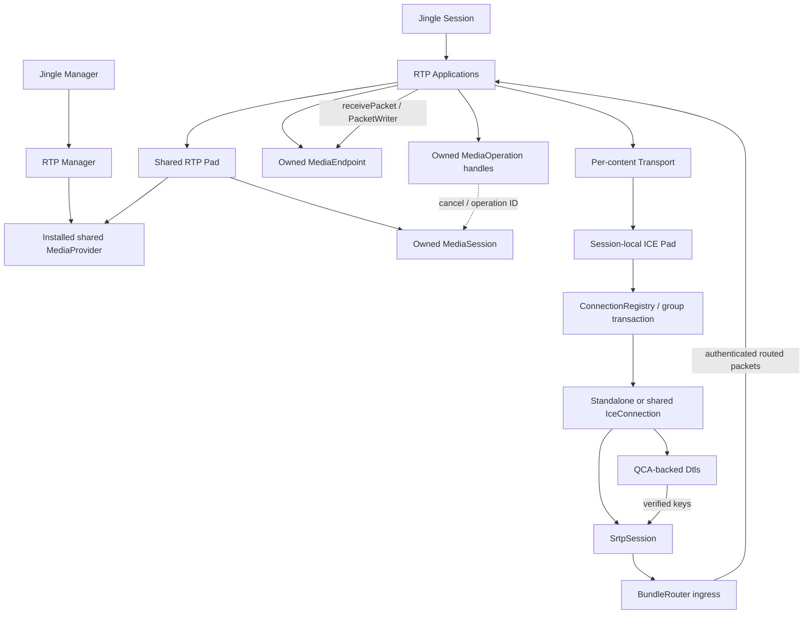
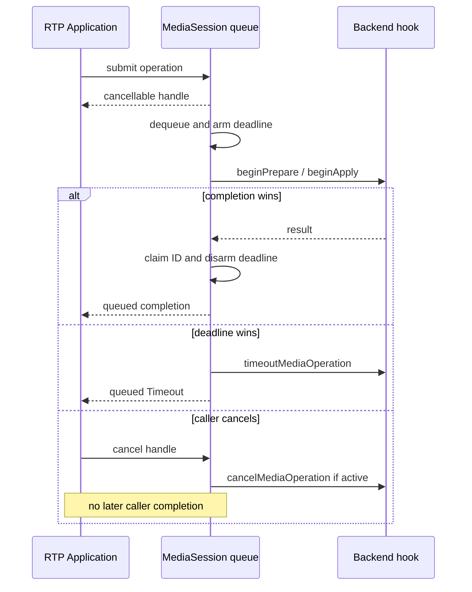
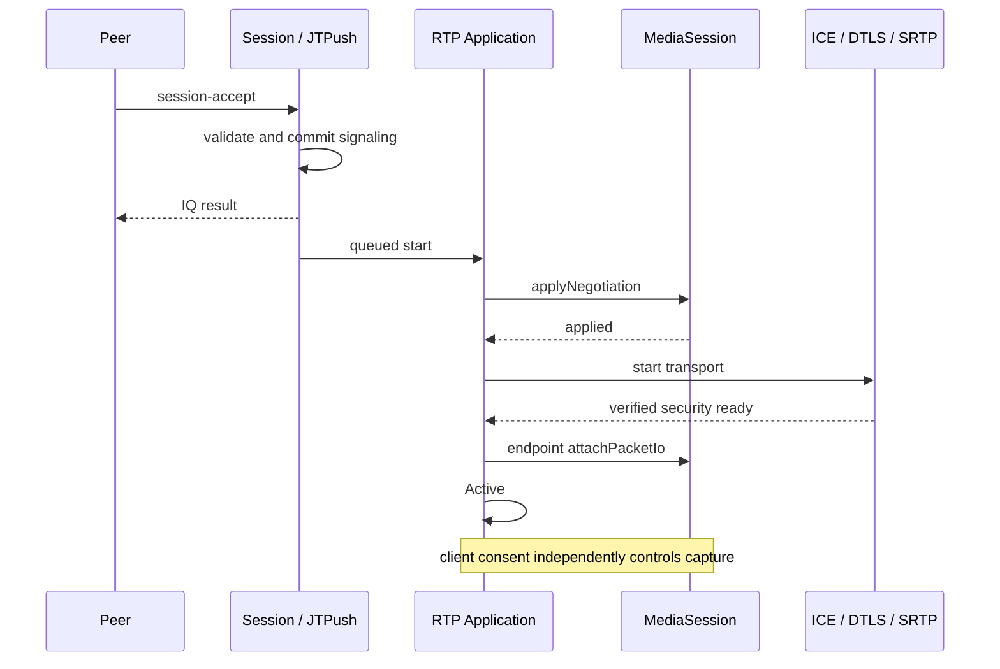
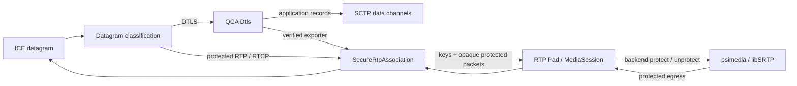
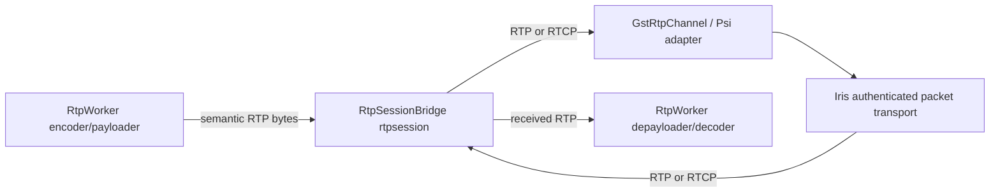

# Native RTP, asynchronous media and DTLS-SRTP

This document describes the current native RTP implementation on `jingle/async-media` as of
2026-09-20. Historical review SHAs and live-peer evidence are recorded in
[jingle-calls-interop.md](jingle-calls-interop.md). It is implementation documentation,
not a development roadmap. [Jingle architecture](jingle.md) describes the generic signaling
and file-transfer lifecycle. Media capture, codecs, playback, device policy and RTP generation
remain outside Iris.

## Scope and implementation status

| Layer | Implemented in Iris | Boundary |
| --- | --- | --- |
| RTP signaling | Description, initial offer/answer, prepared answers, session-info, incoming direction/advisory updates | No complete dynamic codec/track renegotiation |
| Media integration | Provider/session/endpoint interfaces, serialized asynchronous operations, cancellation, deadlines | External backend; Iris unit/integration tests use mock media, while cross-repo gates exercise real psimedia |
| Transport | Custom `ice:0` and standard `ice-udp:1` wire profiles on the existing ICE implementation | Per-content Transport signaling; negotiated BUNDLE members may share one session-local IceConnection |
| Security | QCA DTLS verification/export plus opaque protected RTP/RTCP transport | Packet protection belongs to the media backend; no plaintext fallback for packet-capable RTP |
| Grouping | Session grouping snapshots plus transactional group/membership models wired into ICE::Pad | Initial negotiated BUNDLE and full-group pre-Connecting replacement are implemented; active-call migration/removal still have separate gates |
| Routing | Authenticated BundleRouter wired into RTP::Pad per SecureRtpAssociation ingress | Per-content RTP/RTCP routing is live; SharedRtcp still lacks group-level media ingress |
| Interoperability | Local UDP/DTLS/SRTP, negotiated-BUNDLE regressions and server-mediated Psi↔Psi audio | No Conversations result or external live BUNDLE peer result is claimed |

Advertising the grouping capability alone still does not force BUNDLE: the peer answer must
negotiate a compatible group and every member must support sharing. Once negotiated, ICE::Pad
uses the session-local group registry to bind members to a shared association. JMI and
active-call group-coordinated recovery remain separate work.

## Object and ownership model

`Jingle::Manager::rtpManager()` owns the RTP application manager. A client installs a shared
`RTP::MediaProvider` and explicitly configures its transport namespace whitelist.
The manager has no enabled RTP transports by default.

Each RTP Pad retains its provider snapshot and owns one `MediaSession`. Each Application owns
a `MediaEndpoint` and operation handles. Applications retain their Pad, so endpoints normally
disappear before the shared media session. Replacing the manager's provider affects new Pads,
not an existing session's backend. Pad destruction calls `cancelAll()` while the derived
media-session implementation still exists.

Per-content `Transport` objects keep signaling and replacement identity even when several
BUNDLE members share one `IceConnection`/DTLS/SRTP association. The generic byte/datagram
`Connection` API used by file transfer is separate from RTP's `PacketTransport` interface.

## Descriptions and initial negotiation

`jingle-rtp-description.*` models ordered payload types, optional codec attributes, fmtp,
RTCP mux, feedback, header extensions, sources/source groups and retained extension XML.
Parsing a field or preserving unknown XML does not enable the corresponding backend feature.

`Negotiation` stores detached local/remote snapshots and implements an initial per-content
offer/answer exchange. It validates media type, supplied codec metadata, channel count,
payload identity, mux and supported extension offer/answer relationships. Current payload
mapping retains offered PT identifiers; direction-specific codec parameters remain separate.
RTCP-mux descriptions cannot use PT 64–95.

`CodecNegotiator` is the synchronous codec-specific validation boundary. An asynchronous
backend can supply a prepared answer through `MediaSession::prepareAnswer()`; it need not
block in `makeAnswer()`. Iris still validates the returned answer before committing it.
Backend-specific fmtp/codec support must be implemented by the adapter, not inferred from
successful XML parsing.

The Application stores a pending incoming offer until preparation completes. Preparation
failure becomes a content/session negotiation failure. Accepted descriptions alone grant
neither capture consent nor authenticated packet access.

## Media integration

All public media API calls and backend completion invocations occur on the Jingle thread.
Worker-thread engines marshal their results to that thread. No nested event loops, blocking
negotiation or capture side effects are permitted in factories/negotiation.

### Operations

| Public operation | Backend hook | Result |
| --- | --- | --- |
| `prepareLocalOffer(endpoint, callback)` | `beginPrepareLocalOffer` | Prepared local Description or MediaError |
| `prepareAnswer(endpoint, remote, callback)` | `beginPrepareAnswer` | Prepared local answer or MediaError |
| `applyNegotiation(endpoint, local, remote, callback)` | `beginApplyNegotiation` | Success or MediaError |

One MediaSession serializes operations across all its endpoints. Public callbacks are queued:
even a synchronous backend completion does not invoke the caller inline from the public
submission method. Default hooks bridge legacy synchronous endpoint methods; asynchronous
adapters override the hooks.

A returned `MediaOperation` is a cancellable handle; destroying it cancels the operation.
Cancellation suppresses later caller completion. Applications release handles before stopping
their endpoint. Operation state keeps a raw endpoint pointer, so an independent API consumer
must likewise cancel work before destroying that endpoint.

`MediaOperationPolicy` defaults to 15 s preparation, 10 s apply and 8 pending operations,
in addition to the active operation. Policy changes require an idle queue. Invalid submission
or a full pending queue returns no handle. Deadlines start when an operation becomes active,
not when it first enters the pending queue.

The first accepted backend completion claims the operation and disarms its timer; duplicate,
cancelled, stale-ID and timeout-losing completions are ignored. Timeout queues an explicit
`MediaError::Timeout` for the live caller and invokes `timeoutMediaOperation()`.
Its default delegates to cancellation. Backends with untagged completion signals must ensure
that timed-out work cannot be confused with the next request, for example by failing that
backend instance. Iris operation IDs alone cannot identify an external untagged signal.

`MediaSession::runtimeError` is forwarded by the Pad to its applications. Each live application
fails its media path. It is distinct from an operation-specific error. The adapter must define
safe teardown when its underlying backend has already disposed of resources before notifying
Iris; Iris must not assume that a provider's own stop function is idempotent.

### Readiness and packet I/O

Session acceptance is a signaling milestone. The RTP application asynchronously applies the
accepted descriptions; successful apply starts its transport and enters Connecting. Only
configured media plus an authenticated `SrtpSession` permits `attachPacketIo()`. Successful
attachment moves the Application to Active.

The writer is unusable until Active, and carries the security epoch. Incoming and outgoing
RTP are filtered by negotiated PTs and senders; RTCP remains available to receivers.
Retained writers reject traffic after teardown, destruction or security invalidation.
`stop()` must detach endpoint callbacks; adapters own bounded worker queues and independently
enforce local microphone/camera consent.

Security can become ready before apply finishes; the activation gate handles that ordering too.
Signaling-only endpoints do not become Active merely because their transport is ready.

## ICE wire profiles and security

`ICE::Manager` supplies both `urn:xmpp:jingle:transports:ice:0` and
`urn:xmpp:jingle:transports:ice-udp:1`. Namespace-aware Pad creation retains the selected profile;
`jingle-ice-udp.*` validates/serializes the standard XML model and bridges it to the existing
transport implementation. This is not a second ICE agent. `NSTransportsList` selects the
available profile rather than requiring the peer to advertise every manager namespace.

Production `ICE::Pad` owns a session-local `ConnectionRegistry`. Independent contents obtain
their own membership, while negotiated BUNDLE contents are staged through
`ConnectionGroupTransaction` and resolve through `groupedConnectionFor()` to one shared
`IceConnection`. Transport objects remain per-content and retain signaling/generation identity.
A full negotiated BUNDLE replacement stages a fresh group and switches ownership atomically only
after every member has bound; the old association is then retired.

For packet-capable RTP, `PacketTransport::enableRtpMux()` selects the one-component authenticated
RTP/RTCP path. The answer must accept rtcp-mux; an incompatible answer does not enable raw RTP.
The RTP Pad intersects the media provider's secure-RTP profiles with the profiles supported by
QCA DTLS. This indicates that both sides of the key-export boundary agree on a profile; it does
not imply codec, device or external-peer interoperability.

QCA3 negotiates DTLS-SRTP profiles and exports directional keys/salts after fingerprint
verification. `Dtls` gates application data and key access on authentication and invalidates
them on errors, closure or fingerprint changes. Fingerprints conveyed by signaling do not
independently provide OMEMO-authenticated peer identity.

`SecureRtpAssociation` is deliberately not an SRTP cipher. It binds one authenticated DTLS
association to a stable association id and epoch, owns the verified key-export snapshot, demuxes
DTLS from protected RTP/RTCP, and forwards protected media bytes unchanged to the media backend.
The RTP Pad exports the association parameters to `MediaSession::configureSecureRtpAssociation()`,
installs per-content routing with `configureSecureRtpEndpoints()`, forwards incoming protected
packets to the backend and accepts already-protected outgoing packets from it. Replays, packet
authentication and encryption/decryption therefore belong to the backend (psimedia uses libSRTP),
not Iris.

STUN/TURN handling belongs to the lower network layer. Media does not travel as DTLS application
records. Iris has no libSRTP dependency in this architecture; DTLS/SCTP remains usable through
QCA independently of the media backend's SRTP implementation.

## Group and routing components

These private components now participate in the production shared RTP path:

| Component | Current responsibility |
| --- | --- |
| Session grouping snapshots | Ordered proposals and validated initial peer grouping |
| `GroupNegotiation::initialPlan()` | Pure association plan from members and negotiated groups |
| `GroupPlan::readyToCommit()` | Distinguishes preflight from a plan with required transport parameters |
| `ConnectionRegistry` / `ConnectionMembership` | Session-local association identity and explicit member lifetime |
| `ConnectionGroupTransaction` | Transactional initial BUNDLE commit and staged full-group replacement |
| `BundleRouter` | Routes authenticated RTP/RTCP for every content sharing one SrtpSession |

Group planning checks content identity, sharing support, namespaces and supplied transport
parameter compatibility before ICE ownership is committed. ICE generation, security epoch,
transport-replace generation and route revision remain distinct state and are fenced separately.

BundleRouter uses MID, then known incoming SSRC, then globally unique PT fallback. The selected
content must allow the PT. It validates RTP header/CSRC/extension/padding bounds. Learning and
configured source counts are bounded; local and incoming SSRC tables serve different directions.

Outgoing SSRC registration records actual producer identity independently of static declarations.
A successful registration survives reconfiguration of the same content even if its static SSRC
is removed. Runtime unregister does not remove a still-declared static source. Reconfiguration
is transactional and discards registrations belonging to removed contents.

RTCP routing inspects known sender/report/media SSRC fields. A single matched route returns
`Delivery::Content`; multiple routes return one `Delivery::SharedRtcp` with related contents.
It neither splits nor broadcasts the packet. Unknown or malformed routing input is rejected.
Support for a packet-type case is not exhaustive parsing of every feedback FCI or XR report
block. Consumers need an explicit policy for those additional source references.

RTP Applications bind their negotiated descriptions into the Pad-owned `BundleRouter` keyed by
the actual `SrtpSession`. Ordinary authenticated RTP/RTCP is delivered to the selected content,
so negotiated audio/video members can share one association without sharing one Transport object.

`BundleRouter::Delivery::SharedRtcp` is the remaining routing exception: a compound RTCP packet
that legitimately spans multiple BUNDLE contents is recognized, but the current psimedia API has
no group-level RTCP ingress and Iris intentionally drops that delivery rather than duplicating it
to per-content inputs. This must be resolved before claiming complete live multi-content BUNDLE.
Member removal and active-call shared-association restart also remain separate lifecycle gates.

## Signaling and runtime capabilities

RTP Pad parses ringing, active, hold/unhold and mute/unmute notifications, validating a batch
before notifying consumers. These notifications do not change capture permission.
Incoming content-modify updates senders for applications that opt in. The RTP packet gate
observes senders; backend capture/direction policy remains an external integration concern.
Description-info is advisory, not an arbitrary replacement offer.

Outgoing direction changes use Application::requestSenders(); latest queued intent and
the in-flight IQ value are separate. Successful local ACKs emit sendersChanged, while peer
modifications additionally emit sendersChangedByPeer. The dispatcher uses a session-owned
TieBreaker with Application-level content-modify resolvers. Postponed failed transactions
wake reconciliation after owner callbacks; successful transactions do not trigger tie-break
retry. Clients must still distinguish a failed request from a pending policy target; no
dedicated generic completion notification currently provides that. The proposed controller,
operation and constraint model is in [the design decision](jingle-direction-policy.md), not
yet implemented in the RTP Pad.

## Psi and psimedia production boundary

Psi uses the existing AvCall, BackendSession and native Iris RTP application, not a second
Jingle stack. AvCallPolicy contains pure capability/direction predicates; the production
capability transaction installs the provider before advertising updated features. Audio
hotplug adjusts local direction intent and transmit policy. Actual capture still requires
consent, sender permission and an available input; signaling Active alone is insufficient.

GstRtpSessionContext now owns one RtpSessionBridge per media type. The bridge is connected
to the production packet path, not only an isolated test. Encoder/decoder work stays on
the existing GLib worker; bridge control and queued user delivery use its Qt owner thread.

Negotiated RTP PTs are applied at the payloader rather than rewritten in outgoing bytes.
Opus RTP clock/channels are distinct from raw audio input format. Current production codec
selection is Opus/VP8; generic retained fmtp does not prove complete codec-specific support.
The legacy worker discards GstBuffer timestamps: the byte-oriented bridge input stamps its
own pipeline running time. This is not proof of capture-time-accurate SR mapping or A/V sync.

Delivery queues have packet, byte and age bounds (network 256 packets, media 128 packets,
512 KiB each, 1 s age checked on queue activity). Generation invalidation and guarded owner
callbacks protect stop/restart delivery. These bounds do not bound all GStreamer queues or
the duration of a continuously replenished delivery loop.

Live input-ID changes call RtpWorker::setInputDevices. With an existing sendbin the current
implementation cleans up both send and receive pipelines and recreates them; context and
rtpsession bridges remain alive. It is not an isolated per-source replacement. Live/file
transitions are excluded from this rebuild condition and must not be treated as a supported
capture-switch guarantee. Audio-only sender regression checks late attach/detach/reattach
RTP, not physical source closure or uninterrupted video/receive playback.

Production bridge wiring and negotiated RTP BUNDLE are implemented, while complete hotplug/privacy,
recovery, SharedRtcp media ingress, active-call shared-association migration and external BUNDLE
interoperability remain separate gates.

DTLS fingerprint/setup negotiation is carried in transport descriptions. A generic
security-info handler is not a prerequisite for that path. Transport replacement for an RTP
application is currently disabled from Connecting onward; coordinated group restart/rekey
is not implemented.

RTP Manager discovery uses the installed provider's `mediaTypes()`. Iris does not prove that
those claimed media types are usable codecs. Installing a provider and selecting transport
namespaces are separate configuration steps. The client owns capability probing, consistent
discovery/caps updates and user-facing availability policy.

## Verification and present limits

The standalone `tests/jingle` project includes XML/profile selection, group plan/commit,
ownership, RTP negotiation/prepared answers, media operations, application/runtime errors,
subset acceptance, routing, SRTP and transport ACK regressions.

With system QCA3 and SRTP enabled it also includes loopback ICE/SRTP and mock-media packet
tests in both ICE wire profiles, plus shared BUNDLE ICE/media/signaling regressions. DTLS tests
cover verified keys and, when SCTP is enabled, DTLS application data/data channels alongside
SRTP contexts. These tests do not validate NAT/TURN deployment, an external BUNDLE peer or
Conversations; actual encoded media is covered by separate cross-repo psimedia gates.

Read [interop status](jingle-calls-interop.md) for test scope/results and
[the implementation plan](jingle-calls-implementation-plan.md) for remaining work.
Acceptance scheduling and callback lifetime rules are documented in [the session lifecycle](jingle.md#session-state-versus-connectivity).

## Source map

Paths below are relative to `src/xmpp/xmpp-im` unless stated otherwise.

- `jingle-rtp.{h,cpp}`: Manager, Pad, Application and public media interfaces.
- `jingle-rtp-media.cpp`: serialized operations and deadlines.
- `jingle-rtp-description.*`, `jingle-rtp-negotiation.*`, `jingle-rtp-info.*`: XML and negotiation.
- `jingle-rtp-srtp.*`: PacketTransport, capability probe and SRTP binding.
- `jingle-rtp-router_p.*`: authenticated RTP/RTCP router used by the production RTP Pad.
- `jingle-group-negotiation_p.h`, `jingle-ice-group_p.h`: production group planning,
  membership registry and transactional BUNDLE commit/replacement model.
- `jingle-ice-connection_p.h`, `jingle-ice.*`: resources and production transport.
- `jingle-ice-udp.*`: standard transport wire codec.
- `src/irisnet/noncore/dtls.*`: QCA wrapper and authentication gate.

Protocol references: [XEP-0167](https://xmpp.org/extensions/xep-0167.html),
[XEP-0176](https://xmpp.org/extensions/xep-0176.html),
[XEP-0320](https://xmpp.org/extensions/xep-0320.html),
[XEP-0338](https://xmpp.org/extensions/xep-0338.html),
[RFC 5761](https://www.rfc-editor.org/rfc/rfc5761),
[RFC 5764](https://www.rfc-editor.org/rfc/rfc5764) and
[RFC 7983](https://www.rfc-editor.org/rfc/rfc7983).
