# Jingle architecture and lifecycle

This document describes the current Jingle implementation in Iris. It assumes familiarity with
XMPP and the concepts from XEP-0166 (sessions, contents, descriptions, transports and Jingle
actions), but not with the Iris source tree.

The implementation is intentionally split into two planes:

- **signaling** — `Manager`, `Session`, application/transport managers and pads turn Jingle IQs into
  object updates and serialize local updates back to `<jingle/>`;
- **data** — an `Application` selects a `Transport`, and the transport exposes one or more
  `Connection` objects used by the application to move bytes or datagrams.

For the native Iris stack, the relevant entry point is `XMPP::Client::jingleManager()`.
`XMPP::Client` creates the Jingle manager and registers the file-transfer application and S5B,
IBB and ICE transports. The Jingle manager also owns the native RTP application manager,
accessible through `rtpManager()`, and the separate publication manager. RTP requires a
client-installed media provider and explicitly enabled transport namespaces.

All sessions described here use the native Iris dispatcher; there is no external-manager
bypass. RTP uses an authenticated packet interface rather than the file-transfer `Connection`
interface. See [native RTP architecture](jingle-rtp-design.md) for that data path.

## From XEP-0166 concepts to Iris objects

| XMPP/Jingle concept | Iris object | Lifetime / responsibility |
| --- | --- | --- |
| Jingle engine for one XMPP client | `Jingle::Manager` | Registry for application and transport managers, incoming IQ routing, session lookup by peer/SID, disco features. |
| One Jingle `sid` | `Jingle::Session` | Owns the signaling lifecycle and the set of `<content/>` applications. |
| `<description xmlns='...'>` implementation | `ApplicationManager` + `Application` | The manager is global for an application namespace; each `Application` represents one `<content/>`. |
| Per-session application state | `ApplicationManagerPad` | Adapter shared by applications of the same description namespace in one session; also handles application-specific `session-info`. |
| `<transport xmlns='...'>` implementation | `TransportManager` + `Transport` | The manager is global for a transport namespace; a `Transport` is attached to an application and performs one transport negotiation. |
| Per-session transport state | `TransportManagerPad` | Adapter shared by transports of the same transport namespace in one session. |
| Transport selection/fallback | `TransportSelector` | Owned by an application. Chooses an initial transport and later replacements. |
| Actual application data path | `Connection` | Minimal byte/datagram transfer unit exposed by a transport; shared between the transport and application. |

The most important distinction is that a **pad is not a content and is not a transport**. A pad is
a per-`Session`, per-namespace bridge to a global manager. For example, a session containing three
file-transfer contents normally has three `FileTransfer::Application` objects but only one
`FileTransfer::Pad`.

For an XMPP developer, the split can also be read directly from a content element:

```xml
<content creator='initiator' name='fileoffer_1234' senders='initiator'>
  <description xmlns='urn:xmpp:jingle:apps:file-transfer:5'>
    <!-- application-specific offer -->
  </description>
  <transport xmlns='urn:xmpp:jingle:transports:s5b:1'>
    <!-- transport-specific offer -->
  </transport>
</content>
```

The `<content/>` becomes one `Application`; the `<description/>` namespace chooses its
`ApplicationManager`, while the `<transport/>` namespace independently chooses the current
`TransportManager`/`Transport`. The content name and creator remain application identity even if
the transport is later replaced.

## Object structure

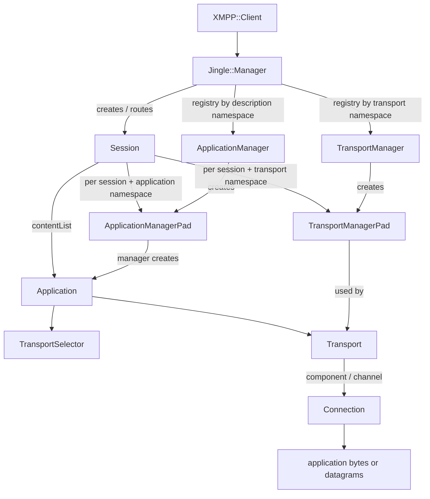

The same relationships shown as a concrete multi-file session are useful for understanding pad
sharing:

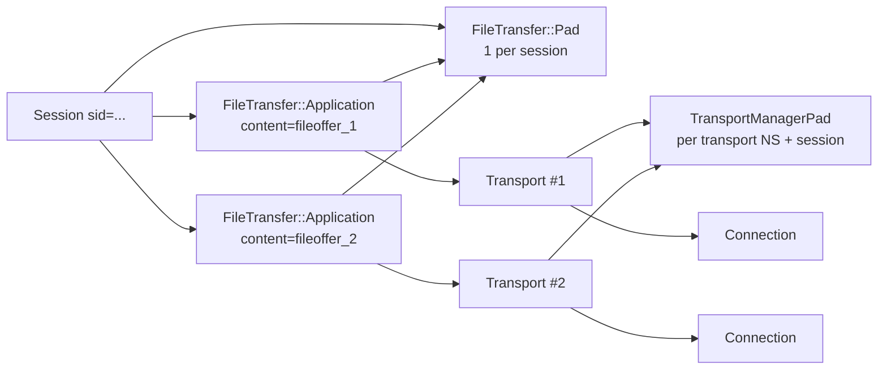

### Managers and registration

`Jingle::Manager` is owned by `XMPP::Client`. Application and transport implementations register
one or more namespaces:

```cpp
jingleManager->registerApplication(applicationManager);
jingleManager->registerTransport(transportManager);
```

A manager is global to the client, while its `pad(Session *)` factory creates the object that binds
that implementation to one session. `Session::applicationPadFactory()` and
`Session::transportPadFactory()` cache these pads by namespace. The cache holds weak pointers;
applications/transports keep the pad alive while they use it.

When an incoming `<content/>` is parsed, the description namespace selects an
`ApplicationManager`, and the transport namespace independently selects a `TransportManager`.
Unsupported description or transport namespaces therefore fail at well-defined points before the
session is exposed to the application UI.

### Application and transport are separate layers

An `Application` is the Iris representation of one Jingle `<content/>`. It owns application-level
state such as the content name, creator, senders, description offer/answer, current transport and
transport selector.

A `Transport` owns connectivity state and signaling for one transport negotiation. It does not
interpret the application description or move file/media semantics itself. Instead it exposes
`Connection` objects with the requested `TransportFeatures`.

For the built-in file-transfer application, the required transport features are:

```cpp
TransportFeature::Reliable | TransportFeature::Ordered | TransportFeature::DataOriented
```

`FileTransfer::Application::prepareTransport()` then waits for a single matching `Connection`.
For a locally-created transport it requests a channel with `Transport::addChannel()`. For a
remote-created transport it installs a connection acceptor and waits for the transport to deliver
a matching incoming connection.

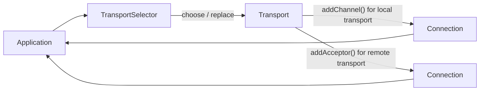

`Connection` derives from `ByteStream`, but also has datagram APIs. The negotiated
`TransportFeatures` tell an application whether to use stream reads/writes or message-oriented
`readDatagram()` / `writeDatagram()`.

## Built-in native Jingle pieces

Iris supplies file-transfer and RTP applications and three transport managers:

| Implementation | Namespace | Relevant manager features |
| --- | --- | --- |
| File transfer | `urn:xmpp:jingle:apps:file-transfer:5` | Requires a reliable, ordered, data-oriented transport. |
| RTP | `urn:xmpp:jingle:apps:rtp:1` | Client-installed `MediaProvider`; packet-capable endpoints require authenticated RTP/RTCP mux. |
| S5B | `urn:xmpp:jingle:transports:s5b:1` | `Reliable`, `Ordered`, `Fast`, `DataOriented`. |
| IBB | `urn:xmpp:jingle:transports:ibb:1` | `AlwaysConnect`, `Reliable`, `Ordered`, `DataOriented`. |
| ICE | `urn:xmpp:jingle:transports:ice:0`, `urn:xmpp:jingle:transports:ice-udp:1` | One manager with namespace-specific wire profiles; mode/build-dependent transport features. |

`Manager::availableTransports()` filters managers by required features. The application still owns
the final policy through `TransportSelector`; Jingle core deliberately does not hard-code a single
transport order.

The ICE data-oriented/ordered feature advertisement is conditional on `JINGLE_SCTP` and
`Dtls::isSupported()`. Registering the ICE manager alone does not guarantee that it can carry
file transfers in a particular build.

## Pads in more detail

`SessionManagerPad` is the common base for application and transport pads. It provides hooks that
run at session boundaries rather than at one specific content instance:

- `onLocalAccepted()` — local user/application consent was given; preparation may begin;
- `onSend()` — the initial `session-initiate` or `session-accept` is about to be serialized;
- `takeOutgoingSessionInfoUpdate()` — produce session-level application signaling;
- `populateOutgoing()` — a virtual extension hook present in the API, but not currently invoked by
  the core session scheduler;
- `doc()` — access the client's XML document through the owning session.

`ApplicationManagerPad` additionally routes incoming application-specific `session-info`. The
file-transfer pad uses this for XEP-0234 `checksum` and `received` payloads. This is why such
messages are not modeled as a fourth file-transfer `Application`: they are session-level events
associated with a content name.

## Session and content identity

`Session::role()` is the local Jingle role: `Initiator` or `Responder`. `peerRole()` is the
opposite.

`Application::creator()` corresponds to the XEP-0166 `<content creator='...'>` value, while
`senders()` corresponds to `<content senders='...'>`. Do not derive one from the other. In
particular:

- a locally-created Iris `Session` normally has role `Initiator`;
- content can still describe either direction of application data;
- `Session::newContent(ns, senders)` creates an application with `creator == session->role()` and
  the requested `senders` value.

Content lookup uses `(content name, creator)` as `ContentKey`, matching the Jingle identity rules.

A second API detail is easy to miss: **`Session::newContent()` does not insert the returned
application into the session**. Configure it first, then call `Session::addContent()`.

## Existing-session tie-break coordination

Incoming Jingle IQs for an already known session use the session-owned `Jingle::TieBreaker`.
For `transport-replace`, Session validates the batch before invoking arbitration; other actions
enter the coordinator from `JTPush` before ordinary `Session::updateFromXml()` processing. The coordinator is
intentionally generic with respect to application and transport semantics: it only correlates the
currently outstanding local Jingle IQ with incoming actions and dispatches registered resolvers.

A session-bound owner may register any number of resolvers for an action:

```cpp
auto registration = pad->tieBreaker()->registerResolver(Action::ContentModify, resolver);
```

`SessionManagerPad::tieBreaker()` is a convenience for application and transport pads; an
`Application`, `Transport`, selector or another session-owned object may also register directly via
`Session::tieBreaker()`. Registrations are move-only RAII handles, so destroying the owner can
unregister it without a separate lifetime protocol.

A resolver receives the serialized local and remote `<jingle/>` elements and returns one of three
solutions:

| Solution | Meaning |
| --- | --- |
| `Continue` | Tie-break does not intervene. The incoming action follows normal Session parsing and may still succeed or fail for unrelated protocol reasons. |
| `Break` | Reject the whole incoming IQ with XEP-0166 `conflict` + `tie-break`. Semantic policy, including whether the local role is allowed to win, belongs to the resolver. |
| `Postpone` | Continue processing the incoming IQ, but remember this resolver until the correlated local IQ finishes. If that local IQ succeeds, the peer accepted our proposal and no tie-break retry is necessary. If it fails, the resolver may reconcile its still-current local intent afterwards. |

All still-live resolvers registered for the matching `Action` are called while the cancellation
epoch remains valid. Advisory hints must not mutate committed state. The aggregate wire
result has deterministic precedence `Break > Postpone > Continue`; a `Break` prevents postponed
retry state from being armed for that incoming IQ.

`Postpone` is bound to an explicit outgoing transaction id, not to an `Application` callback or a
transport state. Completion ordering is significant:

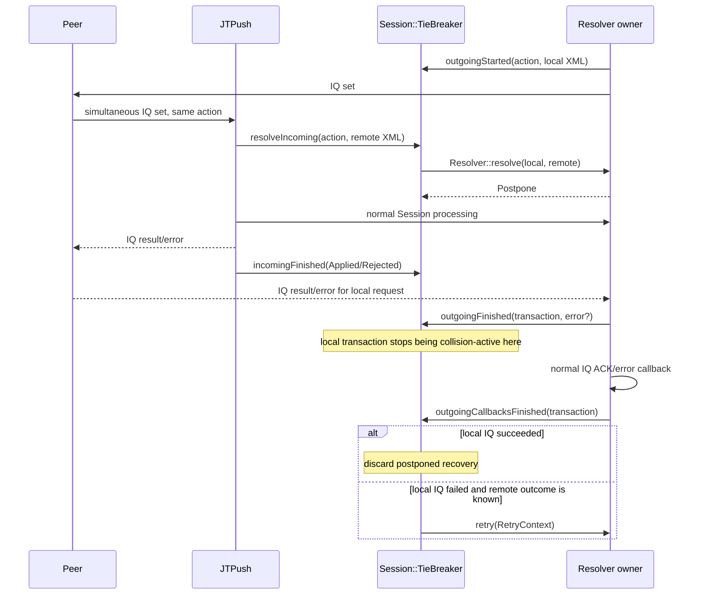

Clearing collision-active state before owner callbacks prevents a reentrant incoming IQ from being
mistaken for the action that has already completed. Delaying `retry()` until after those callbacks
lets the resolver inspect the owner's updated live state. `RetryContext` supplies the original
local XML, the competing remote XML, the local stanza error and whether normal processing of the
remote action was applied or rejected. It is context, not a command to replay the old stanza:
`retry()` should reconcile current owner intent and may send a different update or do nothing.

clear()/destruction invalidates dispatch snapshots, including a currently running retry loop.
Internal state is pinned across callbacks, but pinning does not authorize continuing cancelled
work. XML snapshots do not alias the caller's mutable node handles. Duplicate terminal notices
cannot replace an earlier outcome. The coordinator retains at most 64 remote resolutions;
arbitration snapshots have node/depth/text limits and overload produces `wait/resource-constraint`
through `Resolution::error`, not `conflict/tie-break`.

`content-modify` is the first consumer. Each participating `Application` registers a resolver for
its own `(creator,name)` content. An initiator-side collision returns `Break`; a responder-side
collision returns `Postpone`, applies the initiator action normally, and only reconciles its local
direction intent if its already outstanding IQ later fails. Unrelated contents using the same
Jingle action return `Continue`.

`transport-replace` registers an Application-owned resolver when serializing a local proposal.
An initiator-side overlap in `(creator,name)` returns `Break`; responder processing uses
`Continue`. Installing the winning remote transport invalidates completion of the losing local
attempt. If the remote proposal is not installed, normal failed-IQ fallback remains the sole
recovery path; there is no second retry owner or durable transport intent to replay.

Transport semantics stay in Session/Application/selector. Session stages each incoming batch,
including identity/generation snapshots, before arbitration. `Resolution::localData` is a
detached snapshot of the winning outgoing action on `Break`, used to distinguish competing
contents from advisory siblings. It does not retain a live transaction. Validated sibling
hints are consumed after the IQ error, through a per-request `afterReply` closure guarded by
Session/Application lifetime and transport generation. Supported/unsupported partial outcomes
remain available on the ordinary, non-Break path.

### Staged incoming transport payloads

Incoming `transport-accept` and `transport-info` payloads use a staged transport-update
contract. `Transport::prepareUpdate()` parses and validates one `<transport/>` into an owned
`PreparedUpdate` without mutating live transport/network state, emitting signals or scheduling
work. The default implementation is fail-closed (`Unsupported`); built-in ICE, IBB and S5B
transports provide typed prepared values and apply them through `commitPreparedUpdate()`.

Session first validates the complete content batch and prepares every still-current payload. A
malformed later sibling therefore cannot leave an earlier transport update applied. Only after the
whole required batch is prepared does Session enter the commit pass. Immediately before each
commit it rechecks the content key, `Application`, current `Transport` identity and transport
replacement generation. A reentrant earlier commit may remove or supersede a later sibling; that
stale prepared value is then discarded instead of being applied through a raw pointer.

The atomicity boundary is deliberately limited: parsing/preparation of one incoming batch is
side-effect free, but a successful transport-specific commit may itself be reentrant. Iris does not
pretend to roll back arbitrary callbacks or network effects if a later commit encounters a runtime
failure. Stronger observer-atomic semantics would require separating transport state commit from
notifications. Valid unsupported `transport-replace` entries keep their existing partial-outcome
semantics and are not treated as malformed payloads.

The outgoing `transport-accept` acknowledgement path uses the same replacement generation as a
transaction identity. Completion is validated and retired before invoking transport-specific
callbacks, so duplicate completion, stale transports, same-pointer reselection and nested
accept/reject callbacks cannot complete a newer replacement attempt.

## Signaling scheduler

A session serializes outgoing Jingle IQs through a small scheduler in `Session::Private`:

1. `Application::updated()` marks that application as having signaling work and calls `planStep()`.
2. `Transport::updated()` is connected to `Application::updated()`, so candidate/transport changes
   enter the same path.
3. `planStep()` schedules `doStep()` unless an IQ acknowledgement is outstanding.
4. `doStep()` first handles termination and explicit session-level updates, then `session-info`,
   initial `session-initiate`/`session-accept`, and finally application updates.
5. Only one Jingle IQ is outstanding at a time (`waitingAck`). The completion callback advances
   object states and schedules the next step.

`Action` values are ordered by priority and application updates are collected in a `QMultiMap`.
That ordering is therefore part of how concurrent pending updates are serialized.
This priority applies to the application-update `QMultiMap`, not to explicit session-level
`outgoingUpdates`, which is a `QHash` and has no defined iteration priority.

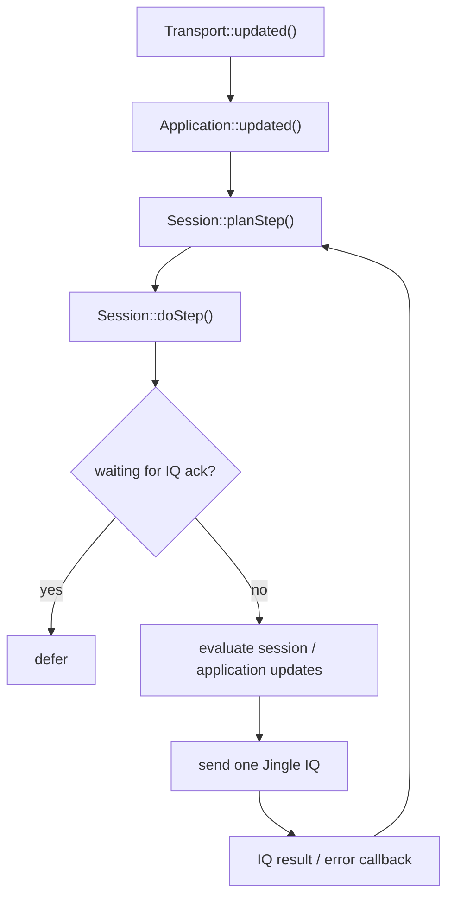

This design is important for extensions: an application or transport should usually update its
own state and emit `updated()`. It should not send Jingle IQs itself.

## Outgoing session lifecycle

The following sequence is the normal native Iris flow, using file transfer as the concrete
application. Transport candidate details are intentionally abstracted; S5B, IBB and ICE implement
different preparation rules.

```mermaid
sequenceDiagram
    actor UI as Application / UI
    participant JM as Jingle::Manager
    participant S as Session
    participant AM as ApplicationManager + Pad
    participant A as Application
    participant TS as TransportSelector
    participant TM as TransportManager + Pad
    participant T as Transport
    participant Peer as Remote XMPP client

    UI->>JM: newSession(peer)
    JM-->>UI: Session (Created, SID not reserved yet)
    UI->>S: newContent(descriptionNS, senders)
    S->>AM: applicationPadFactory() / startApplication()
    AM-->>UI: Application
    UI->>A: configure local offer
    UI->>S: addContent(A)

    UI->>S: initiate()
    S->>S: state = ApprovedToSend
    S->>A: prepare()
    A->>TS: getNextTransport()
    TS->>S: newOutgoingTransport(transportNS)
    S->>TM: transportPadFactory() / newTransport()
    TM-->>A: Transport
    A->>T: prepare()

    T-->>A: updated()
    A-->>S: updated()
    S->>S: planStep() / evaluateOutgoingUpdate()
    Note over S: waits until every initial application can produce ContentAdd
    S->>JM: registerSession(S) and reserve SID
    S->>Peer: IQ set: session-initiate + content(s)
    Peer-->>S: IQ result
    S->>S: state = Pending

    Peer->>S: IQ set: session-accept
    S->>A: setRemoteAnswer() + transport update
    S->>S: state = Active (signaling accepted)
    S-->>Peer: IQ result (sent by JTPush)
    Note over S,A: queued start; skip removed contents or a terminated session
    S->>A: start()
    A->>T: start()
    S-->>UI: activated()

    T-->>A: Connection connected / accepted
    A-->>UI: stateChanged(Active)
```

Two consequences are worth calling out:

- `Manager::newSession()` does **not** immediately put an outgoing session in the manager's SID
  registry. The SID is lazily reserved when the initial applications are ready to produce
  `session-initiate` (or earlier if internal code explicitly calls `reserveSid()`).
- `Session::activated()` is a signaling milestone, not proof that every application's data path is
  connected. Observe `Application::stateChanged()` or application-specific signals when data-path
  readiness matters.

### Session state versus connectivity

The shared `State` enum is used by sessions, applications and transports, but each object uses only
part of it. Both roles reach session-level `Active` after acceptance; applications and transports
can still be `Connecting`:

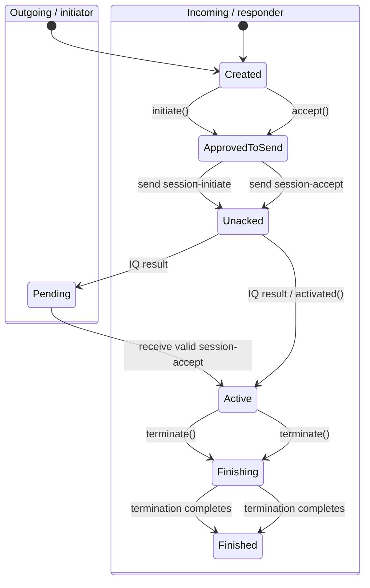

These diagrams show successful local negotiation and termination, not every error/disconnect edge.
`Active` means that session signaling was accepted, not that a usable data channel exists;
see [XEP-0166, acceptance](https://xmpp.org/extensions/xep-0166.html#session-accept).

On incoming `session-accept`, Iris sets `Active` synchronously, but queues application `start()`
and `activated()` until after `JTPush` sends the IQ result. This prevents IBB `<open/>` from
overtaking the acknowledgement ([XEP-0261, section 2.1](https://xmpp.org/extensions/xep-0261.html)).
Incoming `content-accept` in an active session uses the same deferred start, without emitting
another `activated()`. Queued starts check session state, content membership and application state.

Initial acceptance may select a nonempty subset of pending contents. Omitted contents are
detached and cleaned up using guarded object snapshots; cancellation or session destruction
during cleanup prevents committing Active. Ordinary content-accept does not perform this
initial-subset cleanup.

The queued batch skips removed, destroyed or no-longer-Accepted applications and continues
with the remaining accepted contents. Every callback boundary checks Session lifetime and
Active state. Initial activation requires a surviving nonterminal content from the original
snapshot; a replacement object with the same key does not qualify. An empty Session terminates
without activation. The same helper serves later acceptance without re-emitting activated().

The deferred-start ordering assumes the normal single-threaded, non-reentrant IQ dispatch:
application parsing callbacks must not spin a nested event loop.

## Incoming session lifecycle

Incoming Jingle IQs are consumed by the internal `JTPush` task. Before creating a native session it
checks allowed-party policy, redirection, duplicate SID and tie-break
conditions.

A responder `Session` is deliberately **not** registered merely because a syntactically valid
`<jingle/>` IQ arrived. `Manager::incomingSessionInitiate()` first asks the new session to parse all
initial contents. For each content, Iris resolves the application and transport namespaces,
constructs the objects, parses the remote offer and lets the application validate the selected
transport. Only then is the session inserted into the manager registry.

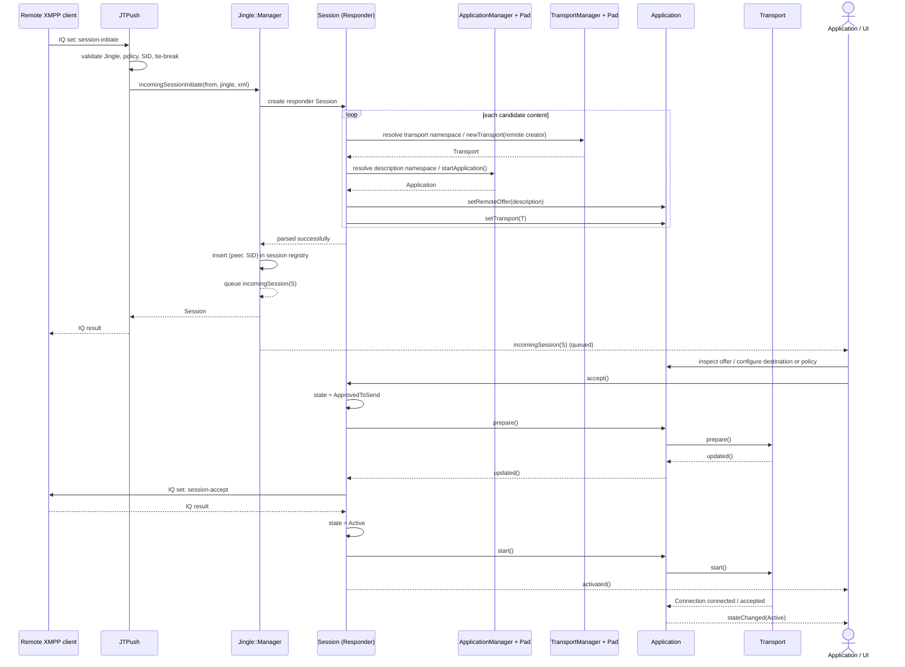

Because `incomingSession` is queued while the IQ result is sent immediately by `JTPush`, remote
acknowledgement of `session-initiate` does not wait for the user to click Accept. User consent is
represented later by `Session::accept()` and the `session-accept` action.

If all initial contents are unsupported or fail early, the session is not presented through
`incomingSession`; Iris schedules the appropriate termination/error path instead.

## Example: sending files (adapted from Psi)

Psi's `MultiFileTransferDlg` is a useful example because it exercises the public API without
manually constructing Jingle XML. In simplified form:

```cpp
using namespace XMPP;

Jingle::Session *session = account->client()->jingleManager()->newSession(peer);

for (const QString &path : files) {
    auto *app = static_cast<Jingle::FileTransfer::Application *>(
        session->newContent(Jingle::FileTransfer::NS, session->role()));
    if (!app)
        continue;

    QFileInfo fileInfo(path);
    app->setFile(fileInfo, QString(), XMPP::Thumbnail());

    connect(app, &Jingle::FileTransfer::Application::deviceRequested, app,
            [app, path](quint64 offset, std::optional<quint64>) {
                auto *file = new QFile(path, app);
                if (file->open(QIODevice::ReadOnly)) {
                    file->seek(qint64(offset));
                    app->setDevice(file);
                }
            });

    session->addContent(app);
}

session->initiate();
```

The production Psi code additionally handles thumbnails, progress, resume ranges, UI state and
session termination. The important architectural ordering is:

1. create the session;
2. create each content;
3. configure the application;
4. add the application to the session;
5. call `initiate()` once all initial contents are present.

See [Psi's `multifiletransferdlg.cpp`](https://github.com/psi-im/psi/blob/master/src/multifiletransferdlg.cpp)
for the complete consumer.

## Example: receiving files (adapted from Psi)

Psi connects once to `Jingle::Manager::incomingSession` and passes a native file-transfer session
to the receive dialog. The session already contains parsed `Application` objects. After the UI has
chosen destinations, the acceptance side can be reduced to:

```cpp
void acceptIncomingFiles(Jingle::Session *session, const QHash<QString, QString> &destinationPaths)
{
    for (auto *content : session->contentList()) {
        if (content->creator() != Jingle::Origin::Initiator
            || content->pad()->ns() != Jingle::FileTransfer::NS) {
            continue;
        }

        auto *app = static_cast<Jingle::FileTransfer::Application *>(content);
        const QString destinationPath = destinationPaths.value(app->contentName());
        if (destinationPath.isEmpty())
            continue;

        connect(app, &Jingle::FileTransfer::Application::deviceRequested, app,
                [app, destinationPath](quint64 offset, std::optional<quint64>) {
                    auto *file = new QFile(destinationPath, app);
                    if (file->open(QIODevice::WriteOnly)) {
                        file->seek(qint64(offset));
                        app->setDevice(file);
                    }
                });
    }

    session->accept();
}
```

In a GUI client the destination normally cannot be chosen inside the `incomingSession` handler
synchronously. Store the `Session *`, present the offer, configure the applications when the user
accepts, and only then call `Session::accept()`. Psi's `MultiFileTransferDlg::initIncoming()` does
exactly this.

These examples omit I/O error reporting and resume policy. In particular, opening a `QFile` with
`WriteOnly` truncates an existing file; a real resume implementation must preserve and validate
the existing prefix before seeking to a nonzero offset. Do not use the simplified receiving
example unchanged for resumed transfers.

Rejecting the invitation is session termination with an appropriate Jingle reason, for example:

```cpp
session->terminate(Jingle::Reason::Condition::Decline);
```

## Transport failure and replacement

Transport fallback is application-owned. `Application::setTransport()` wires transport
updates into the normal Jingle scheduler and `Transport::failed` into
`Application::selectNextTransport()`. The selector owns policy: Jingle core does not hard-code
an ICE/S5B/IBB fallback order.

The implementation has **two distinct state machines** which must not be conflated:

- `Transport::State` describes the concrete transport implementation's lifecycle;
- `Application::PendingTransportReplace` describes the XEP-0166 signaling transaction around
  replacing the current transport.

In particular, `Transport::State::Unacked` is **not** the lifetime of a `transport-replace` IQ.
IBB happens to use `Unacked` while serializing some updates, while the built-in ICE transports
can serialize their Jingle update and remain `ApprovedToSend`. Code deciding whether a
`transport-replace` IQ is outstanding must use the Session TieBreaker's transaction lifetime.
Application signaling state describes per-content workflow: in a multi-content IQ it can still
be `NeedAck` after the IQ completed, while an earlier sibling's completion callback executes.

| `PendingTransportReplace` | Meaning |
| --- | --- |
| `None` | No transport-replace transaction is active. |
| `Planned` | A new local transport was selected, but its `transport-replace` has not been sent yet. |
| `NeedAck` | Our `transport-replace` was serialized and this content's completion callback is still pending. |
| `InProgress` | The replacement proposal is the current signaling attempt known to both sides; final `transport-accept` / `transport-reject` completion is pending. An incoming peer replacement enters this state while its IQ is being processed. |

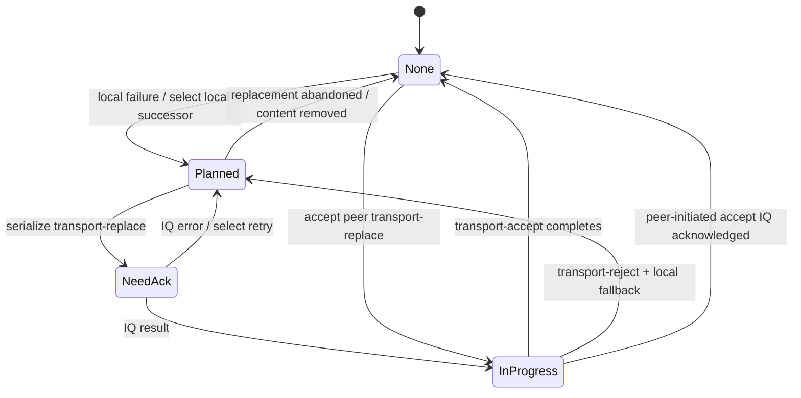

If no compatible fallback remains, `selectNextTransport()` moves the application toward
`content-remove` with `failed-transport` rather than leaving a half-open replacement state.

### Locally initiated replacement

A local transport failure selects a successor and marks the signaling transaction `Planned`.
When the scheduler serializes `transport-replace`, the state becomes `NeedAck`. The IQ result
advances it to `InProgress`; a peer `transport-accept` then updates/starts the same transport
instance and clears the signaling state. `transport-reject` selects another local candidate,
returning to `Planned`.

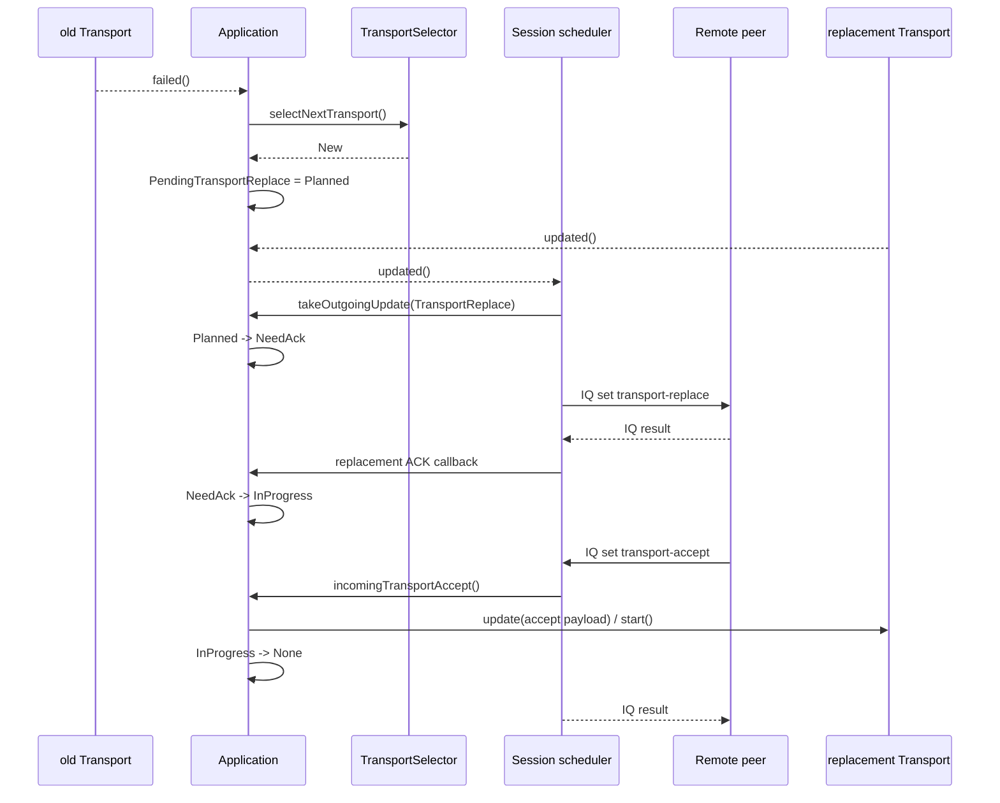

The IQ completion callback is tied to the **specific transport instance and replacement
generation** that produced the stanza. Completion retires that generation and changes NeedAck
to InProgress (success) or Planned (failure) before calling transport-specific code. Reentrant
or repeated delivery cannot invoke that transport callback twice. Terminated/deleted contents
and superseded transports do not receive the stale completion. Failure falls back only if the
same generation and transport are still current after the callback.

A selected successor is a fresh Planned proposal even if the predecessor's Transport::State
still says Unacked. It never inherits an outstanding IQ from its predecessor.

### Peer-initiated replacement

For a valid incoming `transport-replace`, Iris installs the remote proposal and enters
`InProgress`. Once that transport has an outgoing acceptance update, the scheduler sends
`transport-accept`. The IQ result completes only the snapshotted transport transaction and
starts that same transport; it must not act on a newer transport selected by a callback.

### Crossed transport-replace and tie-break

[XEP-0166 tie breaking, section 7.2.16](https://xmpp.org/extensions/xep-0166.html)
gives the initiator precedence for competing actions in an existing session. Iris scopes
`transport-replace` collisions to overlapping ContentKeys in the coordinator's current outgoing
IQ snapshot. This content-scoped arbitration is an implementation policy. `NeedAck` alone is
not proof of a simultaneous action. The losing incoming IQ receives `<conflict/>` plus
Jingle `<tie-break/>`.

There is an advisory optimization in the batch path: although the losing
incoming action is rejected as a whole, already validated sibling remote transport proposals
are still useful as **hints** to `TransportSelector::getAlikeTransport()`. Iris may preselect a
compatible local sibling transport before retrying its own action. The losing remote transport
is not installed, and a prepared local sibling that is about to be signaled is kept intact.
Hint selection happens after sending the rejection, and only if content identity, current
transport and generation still match the validated snapshot. This includes same-object
reselection and changes made reentrantly while sending the reply.

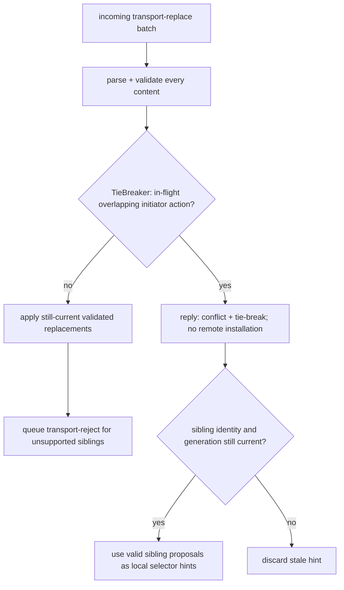

Replacement staging is bounded to 64 contents per IQ. Duplicate keys, unknown contents and
malformed transport payloads fail before arbitration/hint selection. Incoming transport parsing
constructs detached Transport instances and calls their `update()`; it is not a universal pure
parser or a transactional rollback facility for arbitrary provider side effects.

### Batch atomicity and reentrancy

Transport callbacks and selector hooks are treated as reentrant boundaries. In particular,
`TransportSelector::canReplace()`, `isTransportReplaceEnabled()`, `setTransport()`,
`selectNextTransport()`, `Transport::update()` and transport IQ callbacks can synchronously
emit signals or invoke application code. Such code may remove an application, destroy the
session, or select a newer transport for the same content.

Replacement selection also rechecks owner lifetime and generation **inside**
`selectNextTransport()` and `setTransport()` after selector callbacks. A callback that deletes
the owner or installs a new generation cancels the older selection, even when the Transport
pointer is unchanged. Current and candidate transports remain pinned across those callbacks.

For that reason the incoming replace/accept/reject handlers use a validate-then-apply pattern:

1. identify content by stable `(creator, name)` `ContentKey`;
2. guard the `Application` through `QPointer`, because it is a QObject that the session may delete during a reentrant callback;
3. snapshot the current transport through `QWeakPointer`, because transports are shared-pointer
   owned and are not QObject children of the application;
4. validate the complete signaling state required for the action before the first mutating
   callback where protocol atomicity requires it;
5. before each second-pass mutation, verify that the same application is still registered under
   the same key and still owns the transport against which the candidate was validated.

A stale snapshot is never allowed to overwrite newer local intent. For `transport-replace`, an
unsupported sibling can still be returned in a queued `transport-reject`; this **partial batch
success is intentional historical behavior**. By contrast, malformed duplicate identities and
out-of-order accept/reject signaling are rejected before earlier siblings are committed.

This also explains the ownership model. `Application::_transport` is a `QSharedPointer`; the
base `Transport` constructor does not set the application as QObject parent. Mixing QObject
parent ownership with `QSharedPointer` here would make destruction ambiguous. Use
`QPointer<Application>` for application/session QObject lifetime and weak/shared transport
pointers for transport lifetime and transaction identity.

### Regression coverage

The Jingle regression suite contains explicit cases for:

- real ICE serialization not using `Transport::State::Unacked` as Jingle IQ state;
- crossed initiator/responder replacement and sibling tie-break optimization;
- duplicate and malformed `transport-replace`, `transport-accept` and `transport-reject`;
- selector rejection and intentional mixed-batch partial success;
- stale sibling mutation during replace/accept/reject callbacks;
- whole-batch accept/reject signaling-state validation before side effects;
- self-reentrancy where an old transport callback selects a newer local replacement;
- stale outgoing transport IQ acknowledgements not completing a newer transport transaction.

These tests are deliberately about signaling invariants rather than one concrete transport
implementation. Keep them when refactoring transport replacement into more generic Jingle
transaction/tie-break machinery.

## Extending the stack

### Adding an application type

A new description namespace normally needs:

1. an `ApplicationManager` implementation that advertises its namespace/disco features;
2. an `ApplicationManagerPad` implementation that binds the manager to a `Session` and optionally
   handles `session-info`;
3. an `Application` implementation that parses remote offer/answer, serializes local offer/answer,
   chooses compatible transports and exposes application-specific API/signals;
4. registration with `Jingle::Manager::registerApplication()`.

The application's `prepare()` should eventually make
`evaluateOutgoingUpdate()` return `ContentAdd` or `ContentAccept`. For transport-driven
preparation, connect through the base `Application` machinery and emit `updated()` rather than
sending stanzas directly.

### Adding a transport type

A transport namespace normally needs:

1. a `TransportManager` with `features()`, `discoFeatures()`, `newTransport()` and `pad()`;
2. a `TransportManagerPad` bound to one session;
3. a `Transport` that parses/serializes its `<transport/>`, implements preparation/start/stop and
   exposes channels as `Connection` objects;
4. registration with `Jingle::Manager::registerTransport()`.

`Transport::features()` describes what a concrete transport instance can provide, while
`TransportManager::features()` may advertise the union of modes the manager can create.
`canMakeConnection()` filters that set against application requirements.

## Ownership and asynchronous behavior

The API is QObject-heavy and event-driven. Several lifetime details matter when integrating it:

- outgoing `Manager::newSession()` returns a `Session *` whose deletion is scheduled when the
  session reaches `Finished`;
- `Session` schedules deletion of its registered `Application` objects when finishing; its
  destructor deletes any contents still registered;
- applications hold transports through `QSharedPointer` because transport callbacks may outlive a
  signaling step;
- `Connection::Ptr` is shared between transport and application;
- pad factories return shared pointers with session-aware cleanup, while the session caches weak
  references;
- incoming `Manager::incomingSession` and `Session::newContentReceived` are deliberately queued in
  places to avoid re-entering the IQ parser.

Do not keep an unguarded long-lived raw pointer to a session/application across asynchronous UI or
network operations. In Qt code, `QPointer` is usually the appropriate guard.

## Implementation limits and regression checks

The object model above is not a claim of complete XEP-0166 support. In particular,
`Session::updateFromXml()` still falls through to `feature-not-implemented` for `security-info`.
Transport replacement, including incoming `transport-reject`, has dedicated handlers and
regression coverage, but that does not imply successful recovery from every transport-specific
failure or every peer implementation.

`content-reject` removes a pending locally added content, stops its transport and notifies the
application through `incomingRemove()`. Rejection of an initial or already accepted content is
out of order. Other contents remain registered; removing the last content schedules termination.

Incoming `content-modify` validates the entire batch (identities, directions, duplicates,
content lifetime and application support) before dispatch. Applications explicitly opt in via
`supportsContentModify()`; existing fixed-direction file transfers do not. A valid update changes
`senders()` and emits `sendersChanged()` only if the value changes, without starting the application,
changing negotiation state or replacing its transport. This notification is signaling state, not
permission to activate media capture: the media adapter must independently enforce local consent.
Callbacks must not run nested event loops. No `content-accept` is generated in response.
An omitted `senders` means `both`; explicit `none` disables both sending directions.
`Application::requestSenders()` requests an outgoing direction change. Before the initial
content stanza is consumed it updates the proposal; afterwards it retains a queued target
until Active and sends content-modify with an explicit senders attribute. The negotiated
value changes on successful IQ acknowledgement. A newer request can supersede an in-flight
target; a failed unchanged target is discarded rather than retried indefinitely.
`sendersChanged` reports local and remote changes; `sendersChangedByPeer` distinguishes
incoming modifications. Neither signal grants capture consent.

Overlapping peer/local content-modify actions use the session-owned TieBreaker described
above. A failed postponed attempt preserves the queued target for resolver recovery;
the resolver currently wakes the scheduler, it does not merge directional policy itself.
`requestSendersTracked()` returns a scheduling revision. `sendersAttemptFinished()` reports
the concrete attempt ID/revision/target and Accepted, Rejected, TimedOut or Cancelled outcome
after internal cleanup. These are per-IQ notifications, including generic failure, not durable
intent completion. No-op requests have no IQ event. Application destruction is a separate
lifetime notification. `cancelQueuedSenders(revision)` cannot unsend an in-flight stanza.

### RTP local direction policy

`RTP::Pad::directionController()` owns opt-in local-send policy across the pad's contents.
The application supplies explicit consent through `setLocalSending(content, enabled)` and
temporary restrictions through move-only-lifetime `suspendLocalSending()` constraint handles.
All live constraints restrict sending; dropping one cannot override another or revoked consent.
Unmanaged contents retain the existing direct requestSenders behavior. A managed content uses
one policy writer; do not mix controller policy with direct exact-direction requests.

The controller owns only the local sending bit and preserves the peer bit from live negotiated
state. Its queued reconciliation uses the existing Application/Session scheduler. On tie-break
failure it discards its old disposable target and recomputes; generic failure stops retries.
A finite proposal budget also bounds repeated successful proposals countermanded by a peer.
Policy snapshots report Pending/Satisfied/Blocked/Failed/Finished; `policyChanged()` is a
coalesced queued live-state notification, not a one-shot operation handle. Snapshots also expose
typed failure, optional signaling error and diagnostic constraint reasons.

`requestLocalSending({{content, sending}, ...}, deadlineMs)` validates the entire batch before
installing revisions, and returns a caller-owned `DirectionOperation`. The default deadline is
15 seconds; at most 64 items per batch and 32 pending operations per Pad are accepted.
`progressChanged()` exposes per-item snapshots; `finished()` reports one queued terminal
Succeeded/Failed/Cancelled/Superseded result. Even no-op or invalid requests complete through
that queued interface. A blocked sending desire is not satisfied by an effective receive-only ACK.
Success means the direction predicate was observed, not that media connectivity was established.
Cancellation, timeout, supersession and observer destruction do not roll back durable policy
or unsend IQs. Removing/recreating a content name never transfers an old operation to the new
object. Session termination/destruction retires policies even when their Pad is retained.

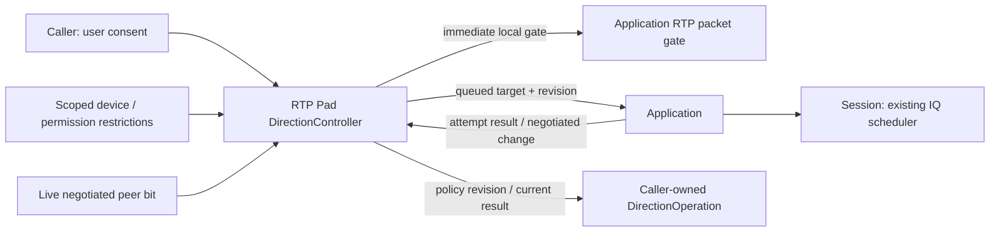

The packet gate does not stop hardware capture: callers must independently keep psimedia's
capture controls consistent with consent and device availability. Psi's audio path uses
`AvCallAudioDirection` to bind explicit call/accept intent, scope the device constraint and
observe completion. Its capture decision includes the controller gate; peer updates cannot
grant local consent. Camera/hold policies are not migrated by the audio adapter.
See [the direction-policy design](jingle-direction-policy.md) for lifecycle and integration details.

`description-info` validates content identities and description namespaces before dispatching to
`Application::incomingDescriptionInfo()`. This hook processes advisory parameters without
replacing the negotiated offer/answer. The default returns false, resulting in
`feature-not-implemented` with `unsupported-info`; application types must implement the payload
semantics explicitly. The current file-transfer application does not override this hook.

Focused executable regressions are in `tests/jingle` (standalone CMake project). They cover
direction parsing/roundtrips and incoming modifications, description dispatch and malformed batches,
pending-content rejection, session destruction with
remaining contents, and DTLS fingerprint comparison. Run with:

```sh
cmake -S tests/jingle -B build/jingle-tests -DUSE_QT6=ON -DIRIS_SYSTEM_QCA=3 -DIRIS_ENABLE_SRTP=ON
cmake --build build/jingle-tests -j2
ctest --test-dir build/jingle-tests --output-on-failure -j1
```

The DTLS-SRTP integration test requires a QCA3 provider supporting
`SRTP_AES128_CM_HMAC_SHA1_80`. It runs two local DTLS endpoints and verifies directional key
agreement, fingerprint mismatch, required-SRTP refusal, key invalidation on fingerprint change,
and plain DTLS application data. With QCA2 it checks that SRTP configuration is rejected.
With `IRIS_ENABLE_SRTP=ON`, it also protects RTP/SRTCP with actual DTLS-exported keys through
system libSRTP. When SCTP is enabled, it transfers and echoes a 32 KiB data-channel message
over QCA DTLS, both without SRTP negotiation and alongside live SRTP contexts. These are
in-memory integration tests, not ICE connectivity or external-client interoperability tests.
The separate SRTP test exercises supported profiles, authentication failure, replay, rollover,
directional keys, stream limits and fail-closed reconfiguration.
The optional `jingle_icertp` test additionally runs native ICE transports over loopback UDP,
exchanges their transport XML and verifies protected RTP/RTCP plus fingerprint-ACK gating.
It requires local socket permissions. `jingle_transportacks` checks IBB acknowledgement
success/failure and callbacks outliving their transport. A non-null IQ task is not evidence of
success: acknowledgement handlers inspect `Task::success()`.
`jingle_rtpmedia` uses the local ICE path with native RTP Applications and mock media endpoints,
checking authenticated attachment, direction/payload filtering and teardown. The media API is
documented in [native RTP architecture](jingle-rtp-design.md#media-integration); no psimedia adapter
or external-client call is exercised by this test.

For the implemented RTP/security interfaces, asynchronous operations and the production
BUNDLE/group-routing path, see [native RTP architecture](jingle-rtp-design.md).

This document covers ordinary session signaling and data transport. It does **not** validate
the separate PubSub authority/reconciliation machinery in `PublicationManager` (`jingle-pub.*`).
Publication IDs and running session SIDs are different identities; the publication manager's
factory creates a new initiator session for a requester, reserves its SID, and then starts the
ordinary lifecycle described above.

Regression scenarios for acceptance (an integration checklist, not a record of executed tests):

| Scenario | Required observation |
| --- | --- |
| Initiator receives a valid `session-accept` using IBB | Session becomes `Active`; outgoing IQ result precedes IBB `<open/>`; `activated()` is emitted once. |
| A later `content-add` is accepted | The new application starts after its `content-accept` IQ result; session activation is not emitted again. |
| Session terminates before the queued start runs | No application starts and no late `activated()` is emitted. |
| A content is removed before the queued start runs | That application is not started, even if its QObject has not yet been deleted. |
| An application start synchronously deletes or terminates its session | Remaining queued applications are not started; no dangling session access occurs. |
| Responder receives the result for its `session-accept` | Existing responder flow still enters `Active` and starts accepted applications. |
| Transport remains disconnected after acceptance | Session remains `Active`; connectivity is represented by application/transport state. |

## Source map

The main implementation files are:

- `src/xmpp/xmpp-im/jingle.h`, `jingle.cpp` — common types, Jingle XML wrapper, manager and incoming
  IQ task;
- `jingle-session.h`, `jingle-session.cpp` — session registry/lifecycle and signaling scheduler;
- `jingle-application.h`, `jingle-application.cpp` — application base, transport selection and
  connection waiter;
- `jingle-transport.h`, `jingle-transport.cpp` — transport interfaces, features, components,
  channels and acceptors;
- `jingle-connection.h`, `jingle-connection.cpp` — application data connection abstraction;
- `jingle-nstransportslist.*` — namespace-list transport selector;
- `jingle-ft.*` — XEP-0234 file-transfer application and pad;
- `jingle-rtp.*`, `jingle-rtp-media.cpp` — native RTP application, media interfaces and asynchronous operation scheduler;
- `jingle-rtp-description.*`, `jingle-rtp-negotiation.*`, `jingle-rtp-info.*` — RTP XML, negotiation and notifications;
- `jingle-rtp-srtp.*` — authenticated packet interface and SRTP association binding;
- `jingle-rtp-router_p.*`, `jingle-group-negotiation_p.h`, `jingle-ice-group_p.h` — authenticated RTP routing, session-local group membership and transactional BUNDLE association management;
- `jingle-ice-udp.*` — standard ICE-UDP wire codec;
- `jingle-s5b.*`, `jingle-ibb.*`, `jingle-ice.*` — built-in transport implementations;
- `jingle-pub.*` — Jingle session publication support, adjacent to the ordinary XEP-0166 session
  lifecycle documented here.

When debugging a native session, a practical reading order is `JTPush::take()` ->
`Manager::incomingSessionInitiate()` / `Manager::newSession()` -> `Session::doStep()` -> the
concrete `Application` -> the concrete `Transport` -> `Connection`.
